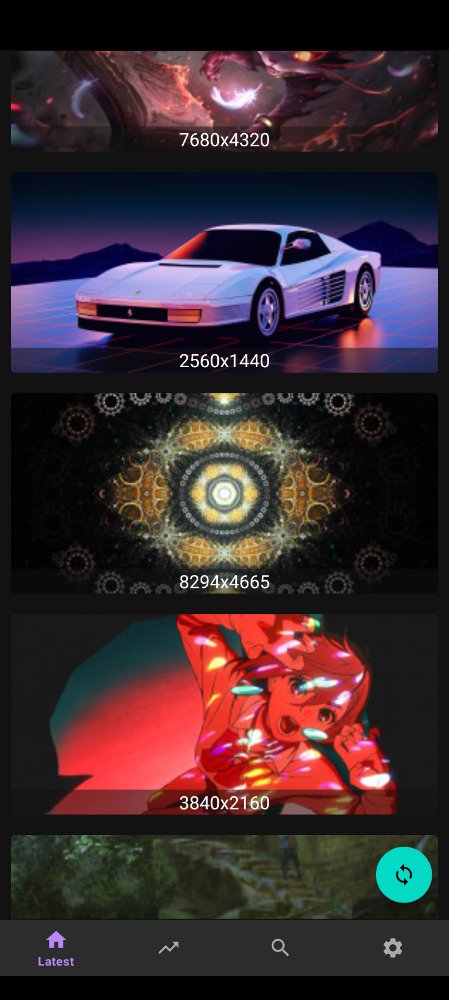
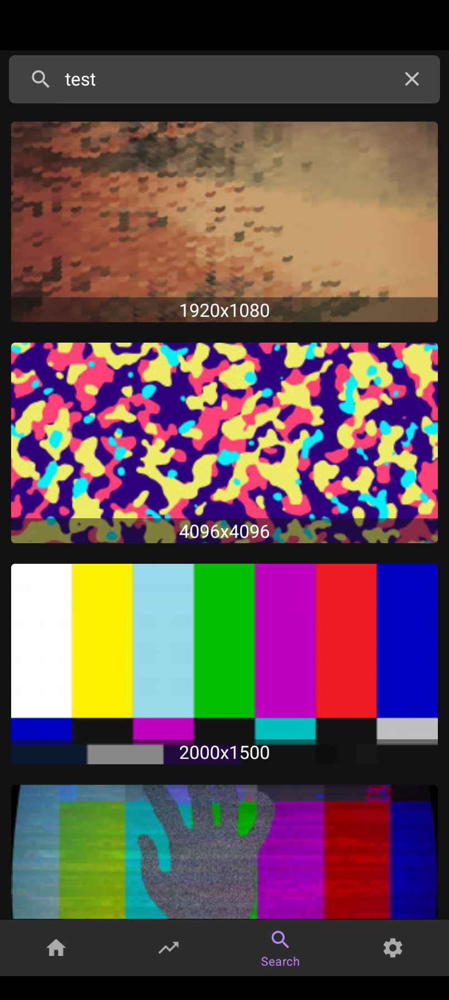

# WallHavenApp
An Android (8.0+) app that lets you view and download wallpapers from the website wallhaven.cc. Uses WallHaven APIv1.

## Installation
Clone this repository and import into Android Studio. This project targets Android SDK 33.

## Screenshots
 